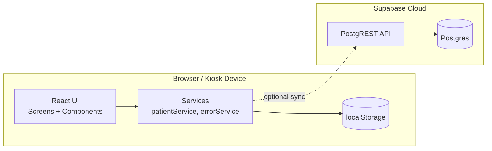

# Architecture & System Design

## High-level architecture

- Frontend: React + Vite single-page app
- Data storage:
  - Primary (offline): Browser `localStorage`
  - Optional (online): Supabase Postgres via `@supabase/supabase-js`

The app is intentionally “kiosk-first”: it runs fully in a browser with no server you maintain.

## Component boundaries (as implemented)

- `App.tsx` orchestrates a step-based flow (no React Router).
- `screens/*` are the primary user-facing pages.
- `services/*` provide persistence + utilities.

## Runtime sequence (summary)

- Patient enters data → stored in React state
- On Success screen mount → `savePatientRecord(data)` persists record
- Admin dashboard polls `getPatientRecords()` every 30 seconds

## Deployment model

- Build: `vite build`
- Host: any static hosting (local kiosk browser, intranet server, etc.)
- Supabase is external managed backend if enabled

## Architecture diagram (Mermaid)

## Key design choices

1. Offline-first persistence: avoids blocking patient check-in when network is down.
2. Step-based state machine in a single component: simple for prototypes but becomes harder to scale as flows grow.
3. Supabase as “backend as a service”: reduces infra burden but requires careful RLS policy design.

## Known architectural gaps

- No queue/event system for “Assistance Requested” (it’s UI-only).
- No real authentication model (prototype PIN only).
- No audit logging.
- No encryption at rest on the client (`localStorage` is plaintext).
