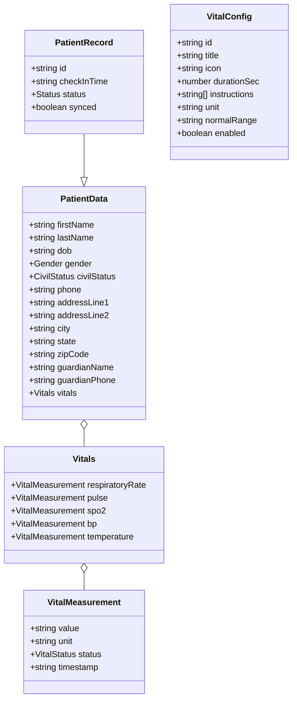
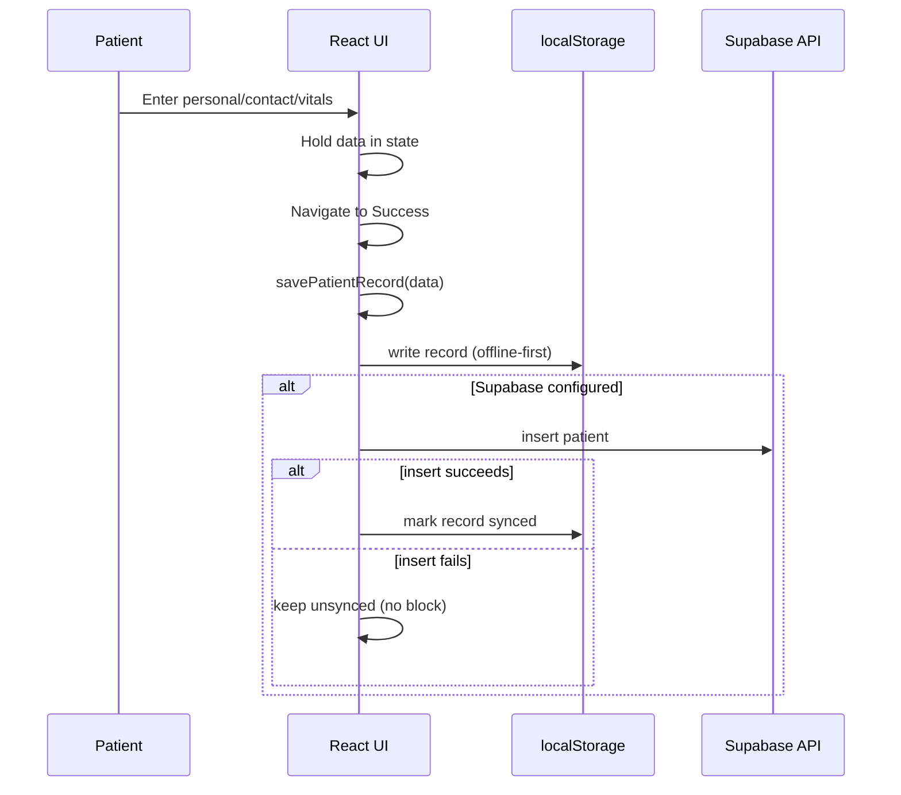
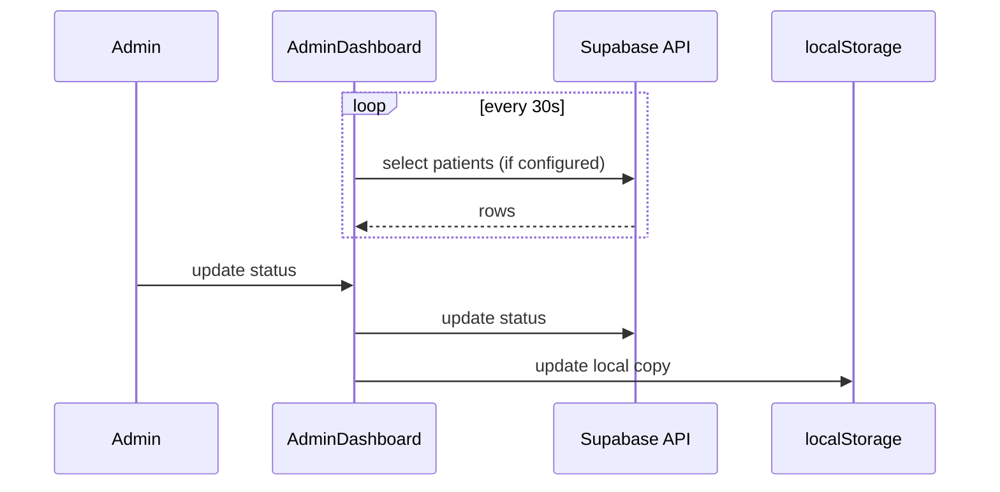
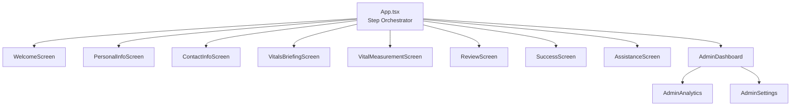

# UML & Diagrams (Mermaid)

## Class diagram (TypeScript domain model)

```mermaid
classDiagram
  class PatientData {
    +string firstName
    +string lastName
    +string dob
    +Gender gender
    +CivilStatus civilStatus
    +string phone
    +string addressLine1
    +string addressLine2
    +string city
    +string state
    +string zipCode
    +string guardianName
    +string guardianPhone
    +Vitals vitals
  }

  class PatientRecord {
    +string id
    +string checkInTime
    +Status status
    +boolean synced
  }

  class VitalMeasurement {
    +string value
    +string unit
    +VitalStatus status
    +string timestamp
  }

  class VitalConfig {
    +string id
    +string title
    +string icon
    +number durationSec
    +string[] instructions
    +string unit
    +string normalRange
    +boolean enabled
  }

  class Vitals {
    +VitalMeasurement respiratoryRate
    +VitalMeasurement pulse
    +VitalMeasurement spo2
    +VitalMeasurement bp
    +VitalMeasurement temperature
  }

  PatientRecord --|> PatientData
  PatientData o-- Vitals
  Vitals o-- VitalMeasurement
```

## Sequence: patient check-in + save

```mermaid
sequenceDiagram
  participant Patient
  participant UI as React UI
  participant Storage as localStorage
  participant Supabase as Supabase API

  Patient->>UI: Enter personal/contact/vitals
  UI->>UI: Hold data in state
  UI->>UI: Navigate to Success
  UI->>UI: savePatientRecord(data)
  UI->>Storage: write record (offline-first)
  alt Supabase configured
    UI->>Supabase: insert patient
    alt insert succeeds
      UI->>Storage: mark record synced
    else insert fails
      UI->>UI: keep unsynced (no block)
    end
  end
```

## Sequence: admin polling + status update

```mermaid
sequenceDiagram
  participant Admin
  participant UI as AdminDashboard
  participant Supabase as Supabase API
  participant Storage as localStorage

  loop every 30s
    UI->>Supabase: select patients (if configured)
    Supabase-->>UI: rows
  end

  Admin->>UI: update status
  UI->>Supabase: update status
  UI->>Storage: update local copy
```

## Component map (simplified)

```mermaid
flowchart TB
  App[App.tsx\nStep Orchestrator]

  App --> Welcome[WelcomeScreen]
  App --> Personal[PersonalInfoScreen]
  App --> Contact[ContactInfoScreen]
  App --> VBrief[VitalsBriefingScreen]
  App --> VMeasure[VitalMeasurementScreen]
  App --> Review[ReviewScreen]
  App --> Success[SuccessScreen]
  App --> Assist[AssistanceScreen]

  App --> Admin[AdminDashboard]
  Admin --> AdminAnalytics
  Admin --> AdminSettings
```
